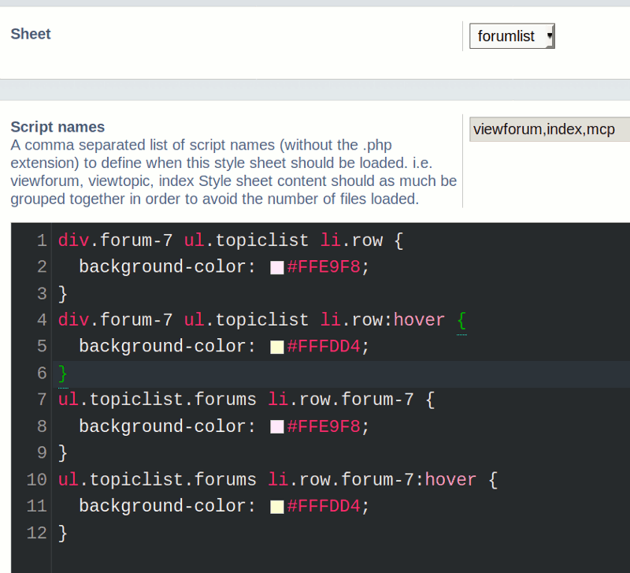
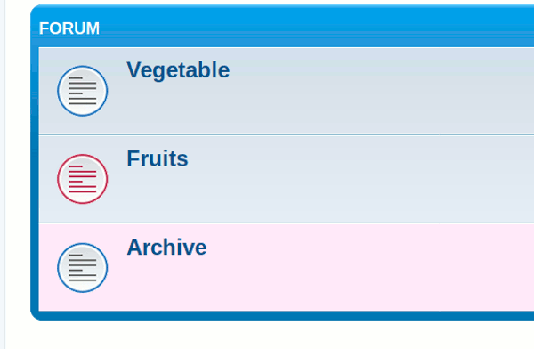
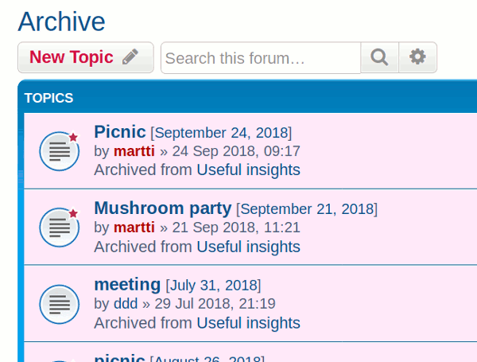
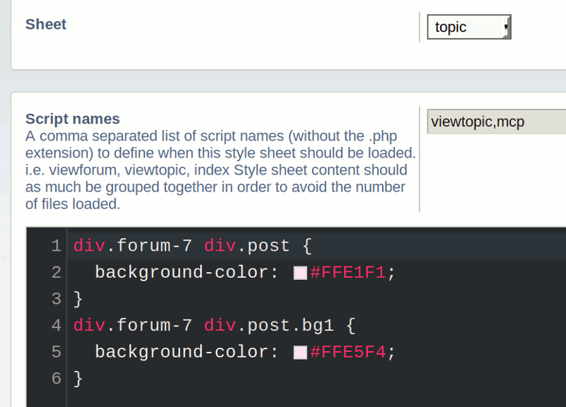
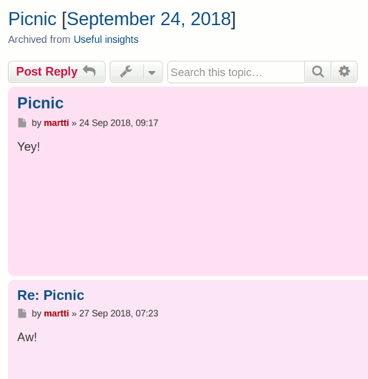
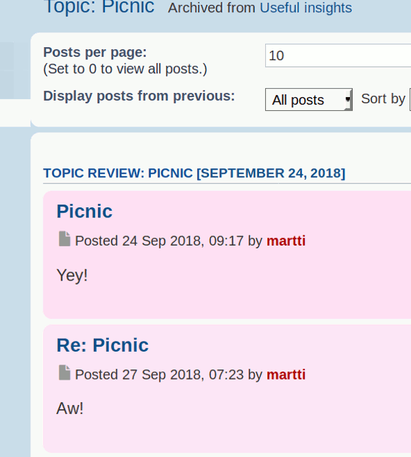
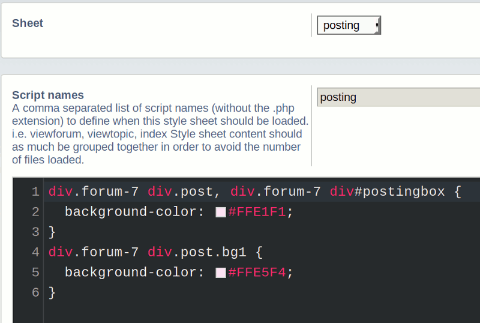
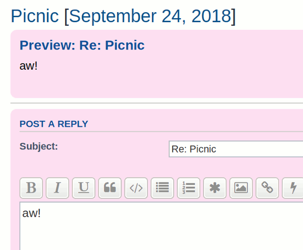
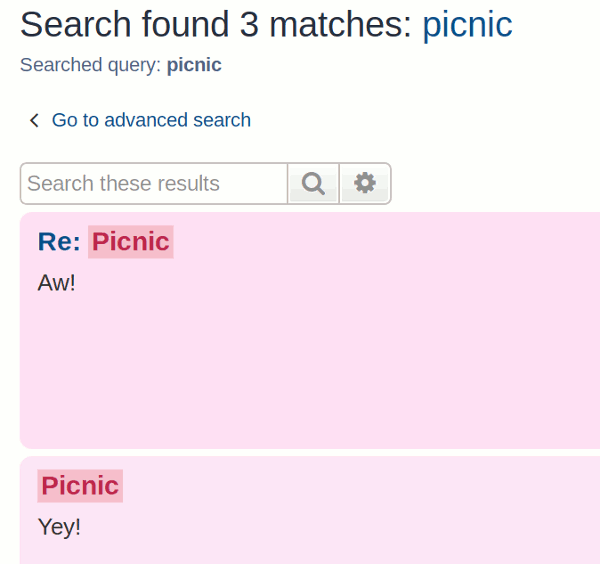

# PhpBB Extension - marttiphpbb Forum Style

[Topic on phpBB.com](https://www.phpbb.com/community/viewtopic.php?f=456&t=2489476)

## Requirements

* phpBB 3.2.1+
* PHP 7.1+

## Features

This phpBB extension adds classes in the form of `forum-ID` to Prosilver (Replace `ID` with the actual forum-id-number). This way certain forums can be given a certain style tweak.
For applying the style itself, i.e the [Extra Style Extension](https://github.com/marttiphpbb/phpbb-ext-extrastyle) can be used.
This extension has no configuration.

## Quick Install

You can install this on the latest release of phpBB 3.2 by following the steps below:

* Create `marttiphpbb/forumstyle` in the `ext` directory.
* Download and unpack the repository into `ext/marttiphpbb/forumstyle`
* Enable `Forum Style` in the ACP at `Customise -> Manage extensions`.
* You can start editing the Forum Style in the Forum ACP for each Forum.

## Uninstall

* Disable `Forum Style` in the ACP at `Customise -> Extension Management -> Extensions`.
* To permanently uninstall, click `Delete Data`. Optionally delete the `/ext/marttiphpbb/forumstyle` directory.

## Support

* Report bugs and other issues to the [Issue Tracker](https://github.com/marttiphpbb/phpbb-ext-forumstyle/issues).

## License

[GPL-2.0](license.txt)

## Screenshots (and How-To-Use)

These examples show how to give one forum a different background color (pink).
These screenshots are produced with the combination of the [Extra Style Extension](https://github.com/marttiphpbb/phpbb-ext-extrastyle).
(Also the effects of the [Archive Forum](https://github.com/martiphpbb/phpbb-ext-archiveforum) and [Calendar Mono/Tag](https://github.com/marttiphpbb/phpbb-ext-calendarmono/doc/set.md) are visible in these examples.)

### Edit Style: Forumlist (Extra Style Extension)

__See the [Extra Style Extension](https://github.com/marttiphpbb/phpbb-ext-extrastyle)__



Code:

```css
div.forum-7 ul.topiclist li.row {
  background-color: #FFE9F8;
}
div.forum-7 ul.topiclist li.row:hover {
  background-color: #FFFDD4;
}
ul.topiclist.forums li.row.forum-7 {
  background-color: #FFE9F8;
}
ul.topiclist.forums li.row.forum-7:hover {
  background-color: #FFFDD4;
}

```

### Index



### Viewforum



### MCP Viewforum


### Edit Style: Topic



Code:

```css
div.forum-7 div.post {
  background-color: #FFE1F1;
}
div.forum-7 div.post.bg1 {
  background-color: #FFE5F4;
}
```

### Viewtopic



### MCP Viewtopic



### Edit Style: Posting



Code:

```css
div.forum-7 div.post, div.forum-7 div#postingbox {
  background-color: #FFE1F1;
}
div.forum-7 div.post.bg1 {
  background-color: #FFE5F4;
}

```

### Posting Preview



### Posting Review


### Edit Style: Search Posts/Topics


```css
div.search.forum-7.post, li.row.forum-7 {
  background-color: #FFE1F1;
}
div.search.forum-7.post.bg1, li.row.forum-7.bg1 {
  background-color: #FFE5F4;
}

```

### Search Posts



### Search Topics


