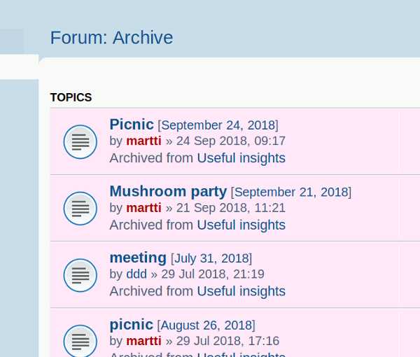
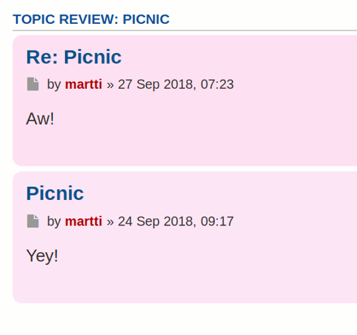

# PhpBB Extension - marttiphpbb Forum Style

[Topic on phpBB.com](#)

## Requirements

* phpBB 3.2.1+
* PHP 7.1+

## Features

This phpBB extension adds classes in the form of `forum-ID` to Prosilver to indicate to which forum posts belong (Replace `ID` with the actual forum-id-number). This way posts or topics belonging certain forum can be given an alternative style (like a different background color). For applying the style itself, i.e the [Extra Style Extension](https://github.com/marttiphpbb/phpbb-ext-extrastyle) can be used.
To know to which HTML elements the `Forum-ID` classes are added, search with the Web Developer Inspector tool of your browser.
This extension has no configuration.

## Quick Install

You can install this on the latest release of phpBB 3.2 by following the steps below:

* Create `marttiphpbb/forumstyle` in the `ext` directory.
* Download and unpack the repository into `ext/marttiphpbb/forumstyle`
* Enable `Forum Style` in the ACP at `Customise -> Manage extensions`.
* You can start editing the Forum Style in the Forum ACP for each Forum.

## Uninstall

* Disable `Forum Style` in the ACP at `Customise -> Extension Management -> Extensions`.
* To permanently uninstall, click `Delete Data`. Optionally delete the `/ext/marttiphpbb/forumstyle` directory.

## Support

* Report bugs and other issues to the [Issue Tracker](https://github.com/marttiphpbb/phpbb-ext-forumstyle/issues).

## License

[GPL-2.0](license.txt)

## Screenshots (and How-To-Use)

These screenshots are produced with the combination of the [Extra Style Extension](https://github.com/marttiphpbb/phpbb-ext-extrastyle).
(Also the effects of the [Archive Forum](https://github.com/martiphpbb/phpbb-ext-archiveforum) and [Calendar Mono/Tag](https://github.com/marttiphpbb/phpbb-ext-calendarmono/doc/set.md) are visible in these examples.)

__In the [Extra Style](https://github.com/marttiphpbb/phpbb-ext-extrastyle) Editor__

### Index

### Viewforum

### MCP Viewforum

### Viewtopic

### MCP Viewtopic

### Posting Preview

### Posting Review

### Search Posts

### Search Topics

